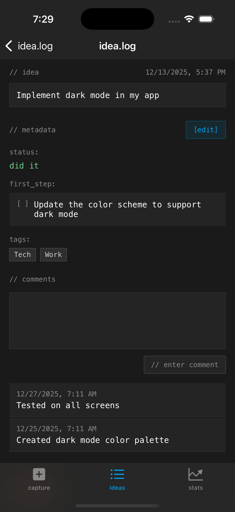
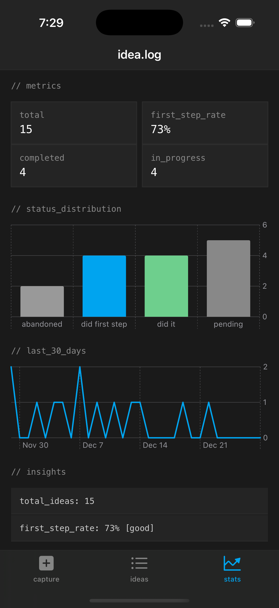
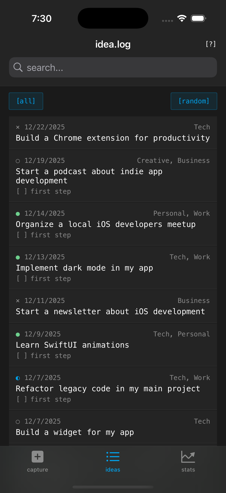
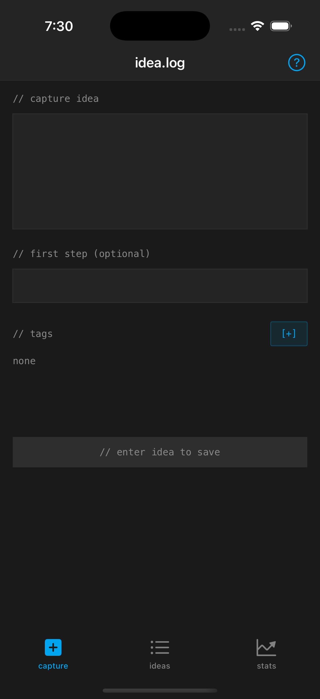

<p align="center">
  <strong>idea.log Skills for Claude Code</strong>
</p>

<p align="center">
  <a href="https://apps.apple.com/us/app/idea-log/id6755640991">Download idea.log</a> &nbsp;|&nbsp;
  <a href="https://heltonlabs.com/idealog">Learn More</a>
</p>

---

**[idea.log](https://apps.apple.com/us/app/idea-log/id6755640991)** is a minimalist, terminal-inspired idea tracker for developers. Capture ideas in seconds, tag them, track progress, and let AI help you act on them. Available on iOS and macOS with CloudKit sync.

This repository contains Claude Code skills that work with idea.log's built-in MCP server to help you manage, develop, and act on your ideas.

<p align="center">
  
</p>

## Why idea.log?

- **Instant capture** — Text, voice, or Siri shortcuts. Get the idea out of your head in under ten seconds.
- **Developer-native UI** — Terminal-inspired dark theme, monospace everything, zero fluff.
- **Built-in MCP server** — Your AI agent can read, create, and manage ideas without you opening the app.
- **CloudKit sync** — Ideas sync across iPhone and Mac through your private iCloud account. No server, no account to create.
- **AI-powered skills** — These Claude Code skills turn your idea backlog into an actionable pipeline.

<p align="center">
  
</p>

## Available Skills

| Skill | Description |
|-------|-------------|
| [Backlog Grooming](skills/backlog-grooming/) | Review all pending ideas, clean up stale ones, improve descriptions, and prioritize what matters |
| [Idea Interview](skills/idea-interview/) | Interactive conversation to flesh out a vague idea into something actionable with tags and first steps |
| [Autonomous Builder](skills/autonomous-builder/) | Pick an idea and autonomously scaffold or implement it as a real project |
| [Weekly Review](skills/weekly-review/) | Generate a weekly summary of idea activity with suggestions for what to work on next |
| [Idea Decomposition](skills/idea-decomposition/) | Break a large idea into smaller, actionable sub-ideas with their own first steps |
| [Stale Ideas Audit](skills/stale-ideas-audit/) | Find ideas that have been sitting untouched and decide what to do with them |

<p align="center">
  
</p>

## Installing the Skills

### From the Claude Code Skill Marketplace (Recommended)

```bash
claude skills install idealog-skills
```

### Manual Installation

Clone this repo and add it to your Claude Code skill search paths:

```bash
git clone https://github.com/wdm0006/idealog-skills.git
```

Then in Claude Code settings, add the path to the `skills/` directory.

### Verify Installation

```
/backlog-grooming
```

If the skill loads, you're set.

## Plugin Bundles

| Bundle | Skills | Description |
|--------|--------|-------------|
| **idealog-complete** | All 6 | Every skill in this repo |
| **idealog-essentials** | Backlog Grooming, Idea Interview, Weekly Review | Core idea management |
| **idealog-builder** | Autonomous Builder, Idea Decomposition | Turn ideas into projects |

## Setting Up the MCP Server

idea.log's MCP server is bundled inside the macOS app. Add this to your Claude Code MCP configuration:

```json
{
  "mcpServers": {
    "idealog": {
      "command": "/Applications/IdeaLog.app/Contents/MacOS/idealog-mcp.app/Contents/MacOS/idealog-mcp"
    }
  }
}
```

The server exposes six tools: `search_ideas`, `get_idea`, `create_idea`, `update_idea`, `add_comment`, and `get_stats`.

## Example Prompts

```
"Groom my idea backlog — clean up anything stale and prioritize the rest"
"I have a vague idea about a CLI tool for managing dotfiles, help me flesh it out"
"Pick my best pending idea and start building it"
"Give me a weekly review of my ideas"
"Break down my 'build a personal API' idea into smaller pieces"
"Audit my ideas and find anything I should just abandon"
```

<p align="center">
  
</p>

## Read More

- [idea.log on the App Store](https://apps.apple.com/us/app/idea-log/id6755640991)
- [idea.log — Product Page](https://heltonlabs.com/idealog)
- [idea.log Now Has an MCP Server](https://mcginniscommawill.com/posts/2026-04-05-idealog-mcp-server/)
- [idea.log Comes to macOS](https://mcginniscommawill.com/posts/2026-04-05-idealog-comes-to-macos/)
- [Share Ideas Between idea.log Users with Universal Links](https://mcginniscommawill.com/posts/2026-04-05-idealog-idea-sharing/)

## Contributing

Issues and pull requests are welcome. If you build a skill that works well with idea.log's MCP server, open a PR.

## License

MIT
