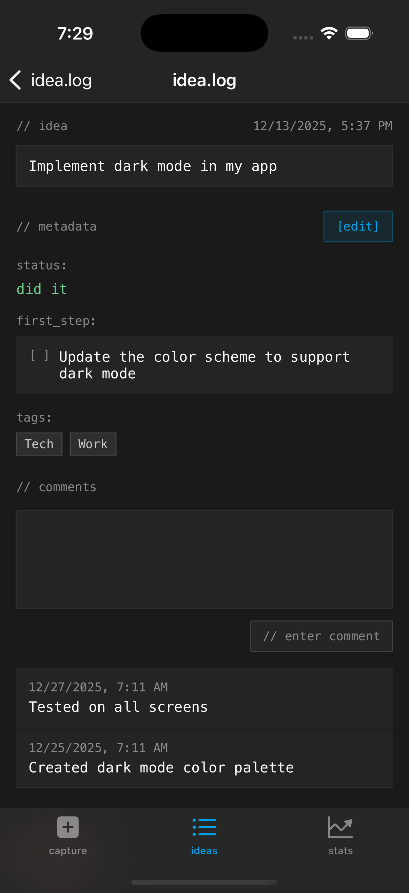
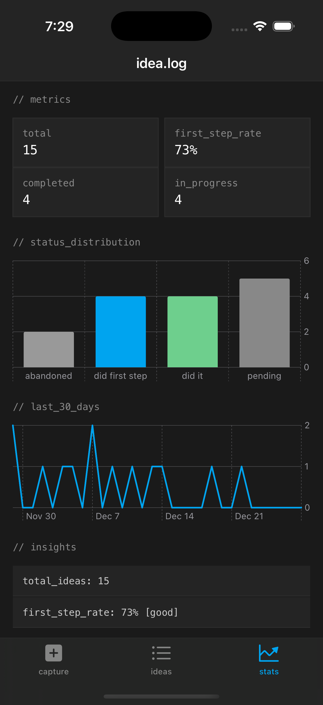
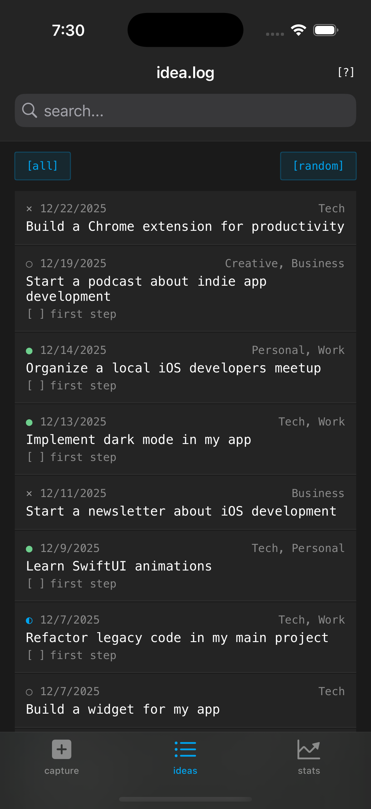
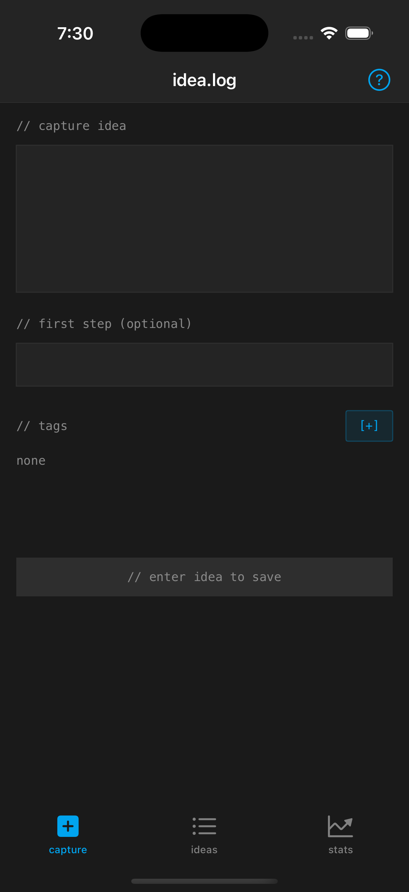

<p align="center">
  <strong>idea.log Skills for Claude Code</strong>
</p>

<p align="center">
  An idea backlog your agent can read and write
</p>

<p align="center">
  <a href="https://apps.apple.com/us/app/idea-log/id6755640991">Download idea.log</a> &nbsp;|&nbsp;
  <a href="https://heltonlabs.com/idealog">Learn More</a>
</p>

---

idea.log is a terminal-styled idea tracker for Mac, iPhone, and iPad. The Mac app
ships a Model Context Protocol server that reads and writes the same on-device
store the app shows you, so an assistant works your real backlog instead of a
pasted export.

This repository is the other half: seven Claude Code skills that use that server to
capture ideas from pasted notes, groom the backlog, turn a vague idea into an actionable one, run a weekly review,
break a large idea into smaller ones, audit ideas that have gone stale, and pick
one and build it.

Requires idea.log for macOS — $4.99 once on the App Store, and where the MCP
server comes from. These skills are MIT licensed and free. The iPhone and iPad
app ships no MCP server.

<p align="center">
  
</p>

## Why idea.log?

- **Your agent works the real backlog** — Six tools over the same store the app
  reads, on macOS. Not an export and not a copy: an idea your assistant files is
  in the app before you switch windows.

- **Capture without opening anything** — Typed text, dictation, Siri, Shortcuts,
  and the Action Button. On iPhone and iPad, Spotlight finds ideas afterwards.

- **A first step, not just a list** — Every idea carries an optional first step
  and moves through four states: Pending, Did First Step, Did It, Abandoned. The
  backlog records whether you started, not just whether you wrote it down.

- **Developer-native UI** — Terminal-inspired dark theme, monospace everything,
  zero fluff.

- **Sync with no account** — Ideas move between your Mac, iPhone, and iPad
  through your own private iCloud. No sign-in, no subscription, and no server of
  ours in the path.

<p align="center">
  
</p>

## What Your Agent Can Actually Do

The macOS app runs the MCP server; these six tools are the whole surface.

| Tool | What it does |
|------|--------------|
| `search_ideas` | Search and list ideas, optionally filtered by status and capped by count. |
| `get_idea` | Full detail for one idea, including its comments and tags. |
| `create_idea` | File a new idea, with an optional first step and tags. |
| `update_idea` | Change an idea's content, status, or first step, or mark the first step done. |
| `add_comment` | Add a comment to an idea. |
| `get_stats` | Summary statistics across the whole backlog. |

Two things worth knowing before you write your own skill against these:

- `search_ideas` matches an idea's content, first step, tag names, and comment
  text — the same fields the in-app search ranks. It returns up to `limit`
  results (default 20), newest first, not ranked by relevance; a truncated
  response reports how many ideas matched in total, so raise `limit` or narrow
  with `status` rather than assume you got everything back.
- Status values are exactly `Pending`, `Did First Step`, `Did It`, and
  `Abandoned`. The skills in this repository share those spellings through
  [`skills/REFERENCE.md`](skills/REFERENCE.md); anything else is rejected.

## One Session, End to End

What backlog grooming actually looks like, in Claude Code on a Mac with the
`idealog` MCP server configured:

> Groom my idea backlog. Anything sitting in Pending with no first step —
> either give it one or tell me to kill it.

1. **`search_ideas`** with `status: "Pending"` returns the pending ideas with
   their content, tags, and whether a first step exists.
2. For each idea with no first step, **`get_idea`** pulls the full record,
   including comments you left months ago and forgot.
3. Claude proposes a concrete first step for the ones worth keeping and calls
   **`update_idea`** to save it — after showing you what it is about to write.
   Grooming asks before it changes anything.
4. For the one that has not moved since April, it drafts the case for dropping
   it, saves that reasoning with **`add_comment`**, and sets
   `status: "Abandoned"` with **`update_idea`** once you agree.
5. **`get_stats`** closes the session with what changed: how many are pending,
   how many now have a first step, what you finished.

Switch to idea.log on the Mac and the changes are already there. Same store, no
import step, nothing to sync by hand.

The other six skills follow the same shape. `idea-capture` files ideas from pasted notes after a duplicate check and a preview you approve. `idea-interview` asks you questions
until a one-line idea has a first step and suggested tags. `idea-decomposition`
turns one large idea into several smaller ones that stand on their own.
`autonomous-builder` picks a pending idea and scaffolds it, confirming the
destination before it writes any files.

## Available Skills

| Skill | Description |
|-------|-------------|
| [Idea Capture](skills/idea-capture/) | Turn pasted notes or a brain dump into deduplicated ideas with first steps and tags, saved only after you approve a preview |
| [Backlog Grooming](skills/backlog-grooming/) | Review all pending ideas, clean up stale ones, improve descriptions, and prioritize what matters |
| [Idea Interview](skills/idea-interview/) | Interactive conversation to flesh out a vague idea into something actionable with tag suggestions and first steps |
| [Autonomous Builder](skills/autonomous-builder/) | Pick an idea and autonomously scaffold or implement it as a real project |
| [Weekly Review](skills/weekly-review/) | Generate a weekly summary of idea activity with suggestions for what to work on next |
| [Idea Decomposition](skills/idea-decomposition/) | Break a large idea into smaller, actionable sub-ideas with their own first steps |
| [Stale Ideas Audit](skills/stale-ideas-audit/) | Find ideas that have been sitting untouched and decide what to do with them |

<p align="center">
  
</p>

## Installing the Skills

These skills are distributed as Claude Code plugins through the marketplace
defined in [`.claude-plugin/marketplace.json`](.claude-plugin/marketplace.json).
Install them using the `/plugin` slash commands inside Claude Code.

### 1. Add this repo as a marketplace

```
/plugin marketplace add wdm0006/idealog-skills
```

### 2. Install a plugin bundle

Pick the bundle that fits how you work, then install it with
`/plugin install <bundle>@idealog-skills`:

```
/plugin install idealog-complete@idealog-skills
```

The available bundles are:

| Bundle | Skills | Description |
|--------|--------|-------------|
| **idealog-complete** | All 7 | Every skill in this repo |
| **idealog-essentials** | Idea Capture, Backlog Grooming, Idea Interview, Weekly Review | Core idea management |
| **idealog-builder** | Autonomous Builder, Idea Decomposition | Turn ideas into projects |

For example, to install just the core idea-management skills:

```
/plugin install idealog-essentials@idealog-skills
```

### 3. Verify installation

Run `/plugin` to see your installed plugins, or start one of the bundled
skills directly:

```
/backlog-grooming
```

If the skill loads, you're set.

## Setting Up the MCP Server

idea.log's MCP server is bundled inside the macOS app — there is no package to
install and nothing to build. Buy the app, then point your MCP client at the
executable inside it:

```json
{
  "mcpServers": {
    "idealog": {
      "command": "/Applications/idea.log.app/Contents/MacOS/idealog-mcp.app/Contents/MacOS/idealog-mcp"
    }
  }
}
```

The server reports itself as `idealog` and exposes the six tools above over
stdio. It is macOS only: there is no server in the iPhone or iPad app, and no
remote endpoint.

For the canonical idea status values (`Pending`, `Did First Step`, `Did It`, `Abandoned`) and how the `update_idea` fields relate, see the [shared skills reference](skills/REFERENCE.md).

## Example Prompts

```
"Groom my idea backlog — anything pending with no first step, give it one or tell me to kill it"
"I have a vague idea about a CLI tool for managing dotfiles, help me flesh it out"
"Pick my best pending idea and scaffold it"
"Give me a weekly review of my ideas"
"Break down my 'build a personal API' idea into smaller pieces"
"Find ideas I have not touched since April and tell me which ones to abandon"
```

<p align="center">
  
</p>

## Read More

- [idea.log on the App Store](https://apps.apple.com/us/app/idea-log/id6755640991)
- [idea.log — Product Page](https://heltonlabs.com/idealog)
- [idea.log Now Has an MCP Server](https://mcginniscommawill.com/posts/2026-04-05-idealog-mcp-server/)
- [idea.log Comes to macOS](https://mcginniscommawill.com/posts/2026-04-05-idealog-comes-to-macos/)
- [Share Ideas Between idea.log Users with Universal Links](https://mcginniscommawill.com/posts/2026-04-05-idealog-idea-sharing/)

## Contributing

Issues and pull requests are welcome. If you build a skill that works well with idea.log's MCP server, open a PR.

A new skill must be listed in the `idealog-complete` bundle in [`.claude-plugin/marketplace.json`](.claude-plugin/marketplace.json), so everyone who installs the full bundle receives it; the curated bundles stay opt-in subsets. Check your change with:

```bash
python3 scripts/validate_skills.py
python3 -m unittest discover -s tests
```

## License

MIT
